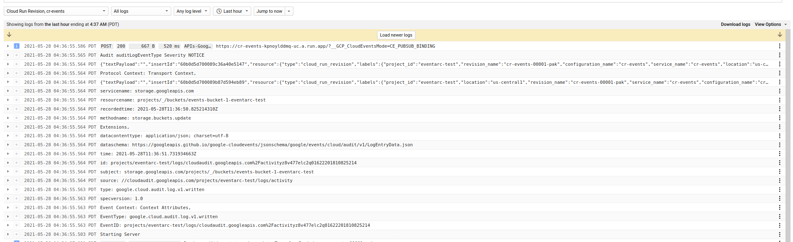
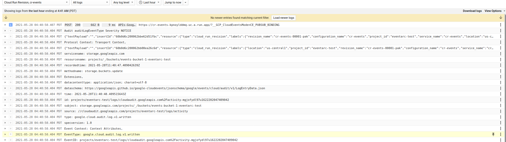
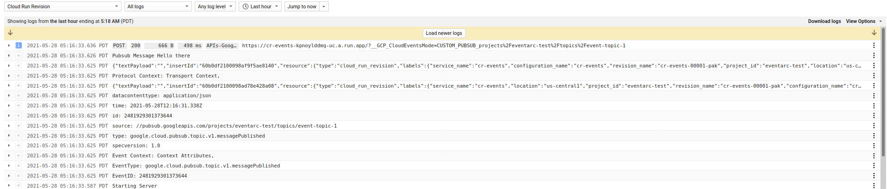

### Cloud Run Eventarc using Cloud Events SDK


This is a sample Cloud Run and standalone application that uses the [Cloud Events SDK](https://cloudevents.io/) to process Eventarc messages.

Basically a http listener deployable to cloud run and a standalone pubsub client that uses the Events SDK to do the following with Eventarc:


1. GCS AuditLogs -> Topic -> Push -> Cloud Run (Cloud Events HTTP Client)
2. GCS AuditLogs -> Topic -> Pull -> CloudEvents PubSub Client 
3. GCS ObjectChange -> Eventarc PubSub  Topic --> Push -> Cloud Run
4. CloudEvents Publisher Client -> Topic -> Push -> Cloud Run (Cloud Events HTTP Client)
5. CloudEvents Publisher Client -> Topic -> CloudEvents subscriber

Cloud Events SDK offers convenient handlers that allow unmarshalling inbound messages:

[event.DataAs(obj interface{})](https://pkg.go.dev/github.com/cloudevents/sdk-go/v2/event#Event.DataAs)

For example, if i wanted to unmarshall an inbound Pubsub Push message from google cloud, i'd use 

```golang
    pubsubv1 "github.com/googleapis/google-cloudevents-go/cloud/pubsub/v1"
    
		pubsubData := &pubsubv1.MessagePublishedData{}
		if err := event.DataAs(pubsubData); err != nil {
			fmt.Printf("DataAs Error %v", err)
			return err
		}

		fmt.Printf("Pubsub Message  %s\n", string(pubsubData.Message.Data))
```

or AudiLogs

> `5/28/21` Note, the sample application uses parses inbound AuditLog events using `"google.golang.org/api/logging/v2"` as shown below

```golang
logging "google.golang.org/api/logging/v2"

		auditData := &logging.LogEntry{}
		if err := event.DataAs(auditData); err != nil {
		}
```

Ideally, it should be parsed using cloudevents directly

```golang
auditv1 "github.com/googleapis/google-cloudevents-go/cloud/audit/v1"

		auditData := &auditv1.LogEntryData{}
		if err := event.DataAs(auditData); err != nil {
		}
```
but there seems to be a compatibility issue: [Cannot unmarshall logEntry.Severity](https://github.com/googleapis/google-cloudevents-go/issues/68)

---

Cloud Events SDK also provides a ready-made transport helpers that listen for HTTP requests and manage pubsub push/pull messages for you.  
For example, if you want to startup a Cloud Events HTTP helper:

```golang
	cloudevents "github.com/cloudevents/sdk-go/v2"
    pscontext "github.com/cloudevents/sdk-go/protocol/pubsub/v2/context"
    
func Receive(ctx context.Context, event cloudevents.Event) error {
}
func main() {
	c, err := cloudevents.NewDefaultClient()
	err = c.StartReceiver(context.Background(), Receive)
}
```

or Pubsub Client  

```golang
func sendMsg(msg string, projectID, topicID string) error {
	t, err := cepubsub.New(context.Background(),
		cepubsub.WithProjectID(projectID),
		cepubsub.WithTopicID(topicID), cepubsub.AllowCreateSubscription(false))

	c, err := cloudevents.NewClient(t, cloudevents.WithTimeNow(), cloudevents.WithUUIDs())

	event := cloudevents.NewEvent()
	event.SetType(pubSubEventType)
	event.SetSource("github.com/cloudevents/sdk-go/samples/pubsub/sender/")
	_ = event.SetData(cloudevents.ApplicationJSON, p.PubsubMessage{
		Data: msg,
	})

	if result := c.Send(context.Background(), event); cloudevents.IsUndelivered(result) {
		log.Printf("failed to send: %v\n", err)
		os.Exit(1)
	} else {
		log.Printf("sent, accepted: %t\n", cloudevents.IsACK(result))
	}
	return nil
}
```


References:

- [Demystifying event filters in Eventarc](https://cloud.google.com/blog/topics/developers-practitioners/demystifying-event-filters-eventarc)
- [Eventarc Quickstart](https://cloud.google.com/run/docs/quickstarts/events#trigger-setup)
- [Trigger Cloud Run with events from Eventarc](https://codelabs.developers.google.com/codelabs/cloud-run-events#0)
- [Configuring Pub/Sub notifications for Cloud Storage](https://cloud.google.com/storage/docs/reporting-changes)
- [Cloud Events envelope encryption extension](https://github.com/salrashid123/ce_envelope_extension)


### Setup

```bash
export PROJECT_ID=`gcloud config get-value core/project`
export PROJECT_NUMBER=`gcloud projects describe $PROJECT_ID --format='value(projectNumber)'`

gcloud config set run/region us-central1
gcloud config set run/platform managed
gcloud config set eventarc/location us-central1

gcloud services enable run.googleapis.com eventarc.googleapis.com logging.googleapis.com cloudbuild.googleapis.com


gcloud projects add-iam-policy-binding $PROJECT_ID \
    --member=serviceAccount:$PROJECT_NUMBER-compute@developer.gserviceaccount.com \
    --role='roles/eventarc.eventReceiver'    
```


### Deploy Cloud Run

```bash
cd app/
gcloud builds submit --tag gcr.io/$PROJECT_ID/run-events .

gcloud run deploy cr-events --image gcr.io/$PROJECT_ID/run-events --allow-unauthenticated --platform managed --region us-central1
```


### 1. GCS AuditLogs -> Topic -> Push -> Cloud Run (Cloud Events HTTP Client)

```bash
$ gcloud eventarc attributes types list

$ gcloud eventarc  attributes service-names list --type=google.cloud.audit.log.v1.written

$ gcloud eventarc  attributes method-names list  --type=google.cloud.audit.log.v1.written --service-name=storage.googleapis.com


gsutil mb -l us-central1 gs://events-bucket-1-$PROJECT_ID

gcloud eventarc triggers create events-trigger-1 \
    --destination-run-service=cr-events \
    --destination-run-region=us-central1 \
    --event-filters="type=google.cloud.audit.log.v1.written" \
    --event-filters="serviceName=storage.googleapis.com" \
    --event-filters="resourceName=projects/_/buckets/events-bucket-1-$PROJECT_ID" \
    --event-filters="methodName=storage.buckets.update" \
    --service-account=$PROJECT_NUMBER-compute@developer.gserviceaccount.com
```

```bash
gsutil defstorageclass set nearline gs://events-bucket-1-$PROJECT_ID
```



## 2. GCS AuditLogs -> Topic -> Pull -> CloudEvents PubSub Client 

for AuditLog
```bash
$ gcloud pubsub topics list
    ---
    labels:
    goog-eventarc: ''
    messageStoragePolicy:
    allowedPersistenceRegions:
    - us-central1
    name: projects/eventarc-test/topics/eventarc-us-central1-events-trigger-1-349

gcloud pubsub subscriptions create audit-sub-1 --topic=eventarc-us-central1-events-trigger-1-349 --topic-project=$PROJECT_ID 
```

```bash
cd pubsub
go run main.go --mode subscribe --projectID=$PROJECT_ID  --subID  audit-sub-1
```

```
gsutil defstorageclass set standard gs://events-bucket-1-$PROJECT_ID
```


```log
go run main.go --mode subscribe --projectID=$PROJECT_ID  --subID  audit-sub-1
    2021/05/28 07:40:50 Event Context: Context Attributes,
    specversion: 1.0
    type: google.cloud.audit.log.v1.written
    source: //cloudaudit.googleapis.com/projects/eventarc-test/logs/activity
    subject: storage.googleapis.com/projects/_/buckets/events-bucket-1-eventarc-test
    id: projects/eventarc-test/logs/cloudaudit.googleapis.com%2Factivity-mgjofydl97u1622202047409042
    time: 2021-05-28T11:40:48.409515643Z
    dataschema: https://googleapis.github.io/google-cloudevents/jsonschema/google/events/cloud/audit/v1/LogEntryData.json
    datacontenttype: application/json; charset=utf-8
    Extensions,
    methodname: storage.buckets.update
    recordedtime: 2021-05-28T11:40:47.409042639Z
    resourcename: projects/_/buckets/events-bucket-1-eventarc-test
    servicename: storage.googleapis.com

    2021/05/28 07:40:50 Protocol Context: Transport Context,

    2021/05/28 07:40:50 projects/eventarc-test/logs/cloudaudit.googleapis.com%2Factivity-mgjofydl97u1622202047409042
    2021/05/28 07:40:50 Audit v ResourceName NOTICE
```




## 3. GCS ObjectChange -> EventTrac PubSub  --> (Push[Cloud Run])


```bash
$ gcloud beta eventarc triggers create gcs-pubsub-trigger-1  \
    --destination-run-service=cr-events   --destination-run-region=us-central1 \
    --matching-criteria="type=google.cloud.pubsub.topic.v1.messagePublished"
                                                                         
    Creating trigger [gcs-pubsub-trigger-1] in project [eventarc-test], location [us-central1]...done.                                                                                                                 
    Created Pub/Sub topic [projects/eventarc-test/topics/eventarc-us-central1-gcs-pubsub-trigger-1-214].
    Publish to this topic to receive events in Cloud Run service [cr-events].
```

```bash
$ gsutil notification create -t eventarc-us-central1-gcs-pubsub-trigger-1-214 -f json gs://events-bucket-1-$PROJECT_ID/


echo -n fobaaaare > /tmp/file1.txt
gsutil cp /tmp/file1.txt gs://events-bucket-1-$PROJECT_ID/
```

View push event to Cloud Run logs

### 4. Pubsub Publisher -> Topic -> Push -> Cloud Run (Cloud Events HTTP Client)

```bash
gcloud pubsub topics create event-topic-1

gcloud eventarc triggers create pubsub-trigger-1 \
  --destination-run-service=cr-events  \
  --destination-run-region=us-central1 \
  --event-filters="type=google.cloud.pubsub.topic.v1.messagePublished"  \
  --transport-topic="projects/$PROJECT_ID/topics/event-topic-1"               

gcloud pubsub topics publish event-topic-1 --message="Hello there"
```




### 5. CloudEvents Publisher -> Topic -> CloudEvents subscriber

```bash
gcloud pubsub topics create ce-event-topic
gcloud pubsub subscriptions create ce-event-sub --topic=ce-event-topic

go run main.go --mode subscribe --projectID=$PROJECT_ID  --subID ce-event-sub

go run main.go --mode publish --message fooo --projectID=$PROJECT_ID --topicID=ce-event-topic
``` 

```log
$ go run main.go --mode subscribe --projectID=$PROJECT_ID  --subID ce-event-sub
    2021/05/28 07:43:41 Created client, listening...
    2021/05/28 07:44:56 Event Context: Context Attributes,
    specversion: 1.0
    type: com.google.cloud.pubsub.topic.publish
    source: github.com/cloudevents/sdk-go/samples/pubsub/sender/
    id: c0d661ad-dc9f-4423-9055-a089a6e07d75
    time: 2021-05-28T11:44:55.402268646Z
    datacontenttype: application/json

    2021/05/28 07:44:56 Protocol Context: Transport Context,

    2021/05/28 07:44:56 c0d661ad-dc9f-4423-9055-a089a6e07d75
    2021/05/28 07:44:56 Pubsub PubsubMessage fooo
```